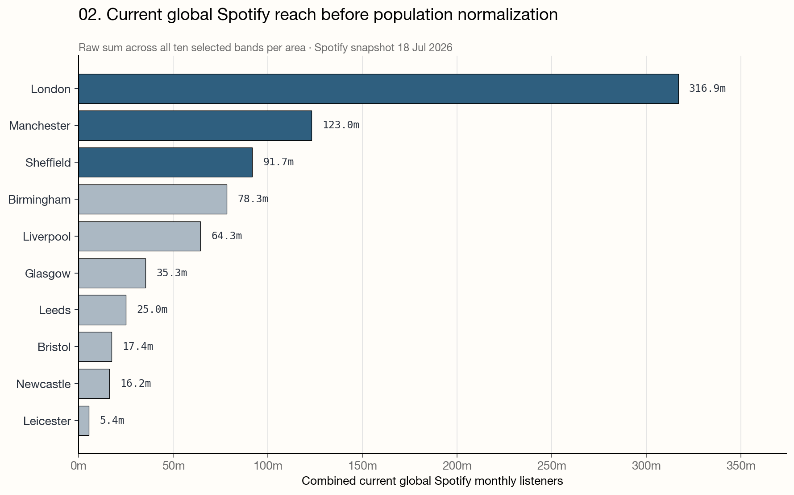
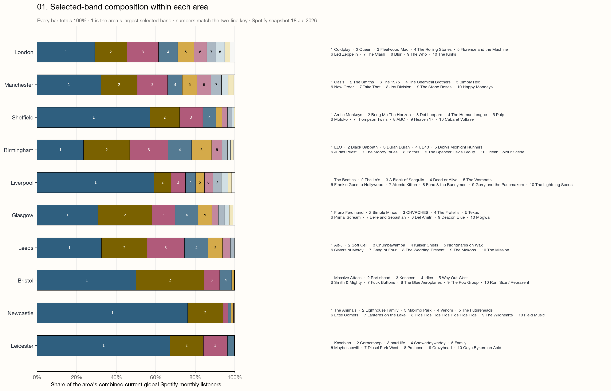
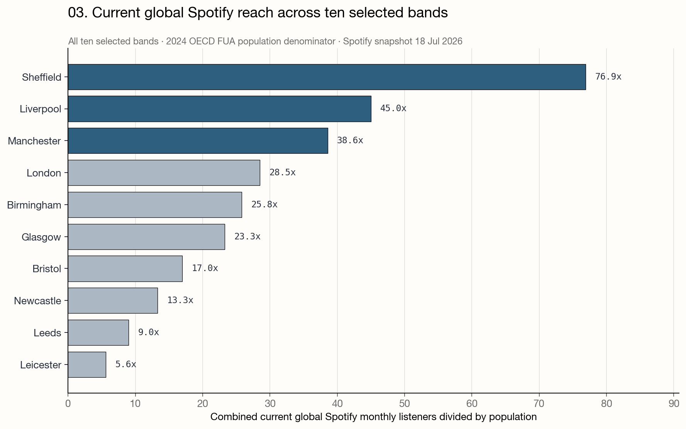
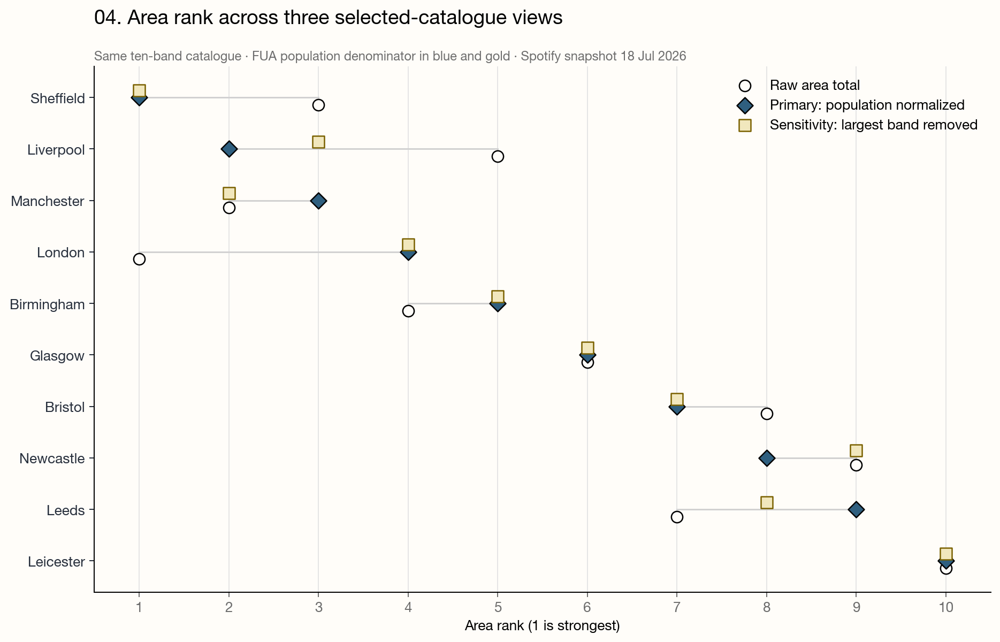

# Where the bands came from

For years, I thought it was completely normal to know where every band came from. Radio DJs had a lot to do with it. Instead of repeating the name of a band, they would say things like "the Liverpool quartet", "the boys from Manchester". Music magazines and reviews did the same. I grew used to hearing geography woven into music talk, so I absorbed it without noticing.

It also made me dream about places that, as a Latin American kid, I was fairly sure I would never visit.

Later, after I emigrated and began meeting people from the UK, they would tell me where they were from and a band would often appear in my head. Someone would say, "Newcastle," and my mind would answer The Animals. Sometimes I said it out loud. It took me a while to realize that this was a particular trait, and not an entirely normal way to respond when meeting someone.

I tend to save it for the smaller places. I would not comment on Liverpool, London or Manchester, where the associations are too obvious. Manchester is a special case anyway. To me, it may be the ultimate city of late-80s cultural impact, because of Joy Division and New Order, The Smiths, and The Stone Roses, Happy Mondays and the rest of Madchester.

There were other cities in my musical imagination. I knew that The B-52's and R.E.M. came from the same Athens, Georgia. And of course Seattle, with a scene that swallowed an entire generation. So much was written about how one place could produce so many important bands. Was it the rain? The kids stuck indoors or in bars? I have no idea whether that explanation laid on solid ground, but I loved it. All these places were remote and expensive to reach. I was convinced I would know them only through records, radio shows and magazine articles.

One evening in late September 2025, I was watching the recording of that year's Pulp –Sheffield!– show in Glastonbury, and I began wondering what how many bands I could name from each British city. The answer was quite a lot. I made a rough list from memory that eventually became the starting point for this project.

The list led to a question: Which British music city punches furthest above its weight?
(Are some of these cities more impactful to the spread of British music than others? Is their impact correlated with population?)

London should be the obvious winner. It is one of Europe's largest cities and one of the most influential cities in the world. With that many people in one place, musicians have a better chance of finding like-minded collaborators, venues, audiences and an industry willing to pay attention. Liverpool has The Beatles, of course, but what happens after The Beatles? Does the city's musical importance survive once its biggest band is taken away?

The largest act may be the wrong thing to look for. I was more interested in which cities had depth: several bands, from different periods, with audiences far beyond the places where they began. Could I measure that without relying entirely on my own taste and the catalogue of hometowns I had carried around since childhood?

That sounded like an interesting data problem.

"Which British music city punches furthest above its weight?" contains at least five smaller questions: What counts as a city? Which bands count as belonging to it? Which type of music?  How should popularity be measured? And what, exactly, does "above its weight" mean?

## Define a city

City boundaries are a nuisance. Manchester's musical life does not stop at a municipal border, and neither does Birmingham's. A band can form in a town that is socially and economically part of a larger urban area while still having a perfectly good local identity of its own.

I used the OECD's [Functional Urban Areas](https://www.oecd.org/en/data/datasets/oecd-definition-of-cities-and-functional-urban-areas.html), or FUAs. An FUA combines an urban centre with the surrounding places connected to it through commuting. It is a consistent geographic indicator, which is the sort thing a comparison needs.

I took the ten largest UK FUAs in the OECD's 2021 population data: London, Manchester, Birmingham, Leeds, Glasgow, Liverpool, Sheffield, Newcastle, Bristol and Leicester.

Bands were assigned by reviewed formation place. That puts Joy Division's Salford origin inside Manchester FUA and The 1975's Wilmslow origin there too, because the frozen OECD assigns Salford and Cheshire East to the Manchester functional area. I did not know about Salford or Wilmslow, I'm not THAT big of a nerd.

## Define a musical act

I excluded solo artists because I was interested in "groups of minds" rather than individual star personalities. Forming a band depends on collaboration and local networks in a way that a solo career does not necessarily capture. It also avoids counting the same success twice when a musician becomes famous with a band and then again alone. Named duos and electronic acts still count when they operate as groups. That decision is debatable, but at least I made it explicit.

## Build ten tiny catalogues

I selected ten bands for each FUA, giving me 100 bands in total. Making every list the same length prevents London from winning simply because I happened to write down seventeen London bands from memory, and only one from Leicester.

This is the largest weakness in the exercise. The lists mix my original shortlist –which was heavily influenced by my adolescence,– automated candidates and later editorial additions. Equalising the number of bands controls the selection size, but it is definitely not a random sample.

The result is therefore a comparison of these catalogues, not a rigorous census of British music. I may have missed your favorite band, and at the same time commited additional statistical sins.

I checked each origin. The final selection has 99 high-confidence assignments and one dubious case: Chumbawamba. It was formed in Burnley, but they matured in a squat in Leeds. So I kept Leeds, and tested the result with and without the band and Leeds's rank did not change.

You can inspect the [origin audit](reference/final_origin_confidence_audit_20260822.md), the [inclusion rules](reference/final_study_methodology.md) and the [executed notebook](notebooks/final/uk_bands_punching_above_weight.ipynb) if that is your idea of a good evening. It is, apparently, mine.

## What does Spotify measure here?

I froze the Spotify figures on 18 July 2026. The metric is monthly listeners, which [Spotify defines](https://support.spotify.com/na-en/artists/article/audience-segments/) as listeners during the previous 28 days. It includes people who deliberately play an artist and people who encounter one through programmed listening.

These are global numbers. They do not tell us how many people in Sheffield listen to Sheffield bands. They also cannot be added into a count of unique humans: one person who listened to Arctic Monkeys, Pulp and Def Leppard can appear in three artist totals.

So the calculation is an index. The numerator is global Spotify attention in July 2026. The denominator is local FUA population in 2021. Dividing one by the other helps compare places of very different sizes, but it does not create a local listening rate. No resident of Sheffield was asked to surrender 78.5 Spotify listeners for the purposes of this research.

Keeping those limits in mind, I calculated three things:

1. the combined monthly listeners of all ten selected bands;
2. the same total divided by FUA population; and
3. the population-normalised total after removing each FUA's largest selected band.

The second is the main result. The third is a sensitivity test: does a city still look strong after its biggest act leaves the room?

## London wins the obvious contest

Before adjusting for population, London is enormous. Its ten selected bands have a combined 316.9 million monthly listeners. Manchester follows with 123.0 million, then Sheffield with 91.7 million.

This is useful context, but it is not surprising. London has more than 12 million people in its FUA and a very large music industry. Asking it to compete on raw totals is like inviting a stadium act to an open-mic night and acting shocked when the amplification is better.

The composition of those totals is more revealing. Every bar below is the same length, but the pieces inside it show how much each selected band contributes. Some catalogues are fairly spread out. Others contain one very large, very famous object.

The Beatles provide 59% of Liverpool's selected total. Arctic Monkeys provide 57% of Sheffield's. Oasis account for 32% of Manchester's, while London's largest selected act, Coldplay, supplies 29%. The Animals make up 76% of Newcastle's total. Newcastle is not so much hiding an elephant in the room as politely asking the elephant to play "House of the Rising Sun".

## Population changes the order

When I divide the same totals by FUA population, Sheffield moves to first place. Liverpool is second and Manchester third. London falls to fourth, followed by Birmingham.

The full order is:

1. Sheffield
2. Liverpool
3. Manchester
4. London
5. Birmingham
6. Glasgow
7. Bristol
8. Newcastle
9. Leeds
10. Leicester

That is the answer to the narrow question I actually calculated. Among these ten FUAs, using these ten-band catalogues, this Spotify snapshot and this population denominator, Sheffield has the largest selected-band Spotify footprint relative to population.

There are enough conditions in that sentence to make a lawyer happy. They matter: without them, the claim becomes much larger than the evidence.

Liverpool's second place is also a warning. The city has an extraordinary musical history, but this particular number is heavily Beatles-shaped. If I want to say something about a broad catalogue rather than one giant export, I need another test.

## What happens when the biggest band goes home?

For each FUA, I removed its most-listened selected band and repeated the population calculation with the remaining nine.

I originally called this "scene depth". That now feels too grand. Removing one band cannot reveal the true depth of a city's music scene, especially when the other nine were selected rather than sampled. The more accurate name is dominant-band sensitivity within the selected catalogue. Less catchy, more honest.

Sheffield stays first after Arctic Monkeys are removed. Manchester moves from third to second without Oasis. Birmingham rises from fifth to third without ELO. London remains fourth. Liverpool drops from second to fifth when The Beatles leave.

This result makes Sheffield interesting. Its primary total is concentrated in Arctic Monkeys, yet the other nine selected bands still produce the strongest population-normalised total in the comparison. Manchester also looks less dependent on one act than Liverpool does. Birmingham's selected catalogue is the least concentrated of the ten: ELO contributes about 23% of its total.

But the sensitivity test does not certify any city's scene as "deep". It says only that the ranking is more or less vulnerable to the largest selected band. That is a useful thing to know. It is not the same thing as measuring every venue, label, rehearsal room, tiny band and musical friendship that made a scene possible.

## So, which city wins?

If the contest is raw selected Spotify reach, London wins easily.

If it is selected reach relative to population, Sheffield comes first.

If the largest selected band is removed, Sheffield still comes first, Manchester moves up and Liverpool falls.

This may sound like an evasive answer to a ranking question. I think it is the answer. Rankings are built, not discovered whole. Change the catalogue, geography, platform metric, population denominator or treatment of the biggest band and the order can change too.

The exercise is still useful, but the rules have to travel with the result.

On those terms, Sheffield performs strongly in both published views of this selected catalogue. Liverpool's result is much more sensitive to The Beatles. Manchester combines a large raw total with less dependence on its biggest selected act. London has the largest absolute footprint but loses its automatic advantage once population enters the calculation.

None of this makes Sheffield objectively Britain's best music city. The data do not measure local listening, cultural importance, historical influence or every band. They certainly do not prove that living in Sheffield causes musical success, although the local weather is free to submit a competing theory.

## What this does not mean

These numbers do not measure local listening, show that a city caused a band's success, rank historical importance or cover every band from each area.

It is a comparison of current global Spotify attention within one frozen, selected-band catalogue. The population adjustment makes differently sized FUAs easier to compare. The dominant-band test shows how much each result depends on one act. Both are useful as long as they keep their labels on.

The original question was "Which city is most important to British music?" After doing the work, I no longer think that question has one clean answer. "Important" was carrying far too much luggage.

I prefer the smaller question now: under a clearly stated set of rules, which places look unusually strong, and why does the answer change when the rules change?

That question is less dramatic. It is also much more fun.

## Later posts

### 1. What happens when the catalogue changes?

The ten-band lists are the same size, but they are not representative. They mix my original shortlist with database candidates and later editorial choices. The [catalogue-selection sensitivity experiment](notebooks/experiments/24_uk_bands_catalogue_selection_sensitivity.ipynb) is the starting point for a follow-up about how much the result depends on who made the list. That post will also use the original shortlist as part of the story: this project began with memory and taste, then ran into selection bias.

I have also moved the rank-range and top-five-frequency material from [experiment 16](notebooks/experiments/16_uk_bands_specification_multiverse.ipynb) to this follow-up. It was roadmap item 3 for the first article, but it is too large a methodological detour for the piece I am publishing now.

### 2. What do the Spotify numbers actually measure?

[Spotify defines monthly listeners](https://support.spotify.com/na-en/artists/article/audience-segments/) over the previous 28 days and includes active and programmed listening. The same person can appear in several artists' totals. Dividing global artist totals by local population produces a comparative index, not a local listening rate. Removing the largest selected band tests dominant-band sensitivity within that catalogue, not the depth of an entire scene.

A later measurement post can compare monthly listeners, followers and Wikipedia attention without rolling them into one cultural-importance score. It can also tell the story of why the project moved from followers to monthly listeners in the first place.

### 3. Where is a band actually from?

The [origin-confidence audit](reference/final_origin_confidence_audit_20260822.md) left one useful dispute unresolved. AllMusic places Chumbawamba's formation in Burnley, while other accounts place it in the Armley squat in Leeds. A later post can use archival sources or interviews and compare several origin rules: members' home towns, first rehearsal, first public performance, early-career scene and later base. It can also test recording more than one locality instead of forcing every band into one FUA.

### 4. Scenes, not superstars

The infrastructure, genre, generation and network experiments belong together in a separate study of how scenes develop. That work needs reviewed formation years and genre families, historical venues and studios, local media and education, and period-appropriate population and economic controls. Member, producer, label, venue and education ties should remain separate networks. Present-day OpenStreetMap counts are useful leads, but they cannot explain scenes that formed decades ago.

### 5. Cultural footprint versus platform momentum

The two-date Spotify comparison is a baseline, not a trend. A later post should follow the same artists monthly for at least 18 to 24 months, then annotate releases, tours, reissues, viral moments, deaths and membership changes. Stable signals such as Wikipedia, YouTube, Last.fm, charts, radio play and set-list activity can help separate accumulated footprint from short-lived attention. The collection has to start before the article because historical monthly listener observations cannot be reconstructed reliably later.

### 6. What changes when solo artists are included?

The current study is deliberately about bands. A separate scope test can add solo artists and show which cities and genres were suppressed by that choice, rather than quietly mixing two different catalogues into the present article.

---

# Article draft: Where the bands came from

For years, I thought it was completely normal to know where every band came from.

Radio DJs had a lot to do with it. Instead of repeating a band's name, they would say "the Liverpool quartet" or "the boys from Manchester". Music magazines did the same. Geography was woven into the way people talked about music, so I absorbed it without noticing.

It also made me dream about places that, as a Latin American kid, I was fairly sure I would never visit.

Later, after I emigrated and began meeting people from the UK, someone would tell me where they were from and a band would immediately appear in my head. "Newcastle," they would say. The Animals, my brain would reply. Sometimes my mouth joined in. It took me a while to realise this was a particular trait of mine and not the normal response to meeting a new person.

I usually spare people from Liverpool, London and Manchester because the associations are too obvious. Manchester is a special case anyway. In my mind, it is the great late-1980s collision of post-punk, indie and dance music: Joy Division and New Order, The Smiths, The Stone Roses, Happy Mondays. A city can become part of the sound.

There were other places lodged in my musical imagination. I knew The B-52's and R.E.M. came from the same Athens, Georgia. I knew about Seattle, where one scene seemed to swallow an entire generation. Some people blamed the rain. The kids were stuck indoors or in bars, the story went, so their only escape was to make music. I have no idea whether that explanation survives contact with evidence, but I loved it.

Then, last September, I began wondering how many bands I could name from each British city. The answer was: quite a lot. I made a rough list. It was based on memory, taste and whatever records had managed to colonise my brain over the years.

The list led to a question that sounded simple and turned out not to be:

